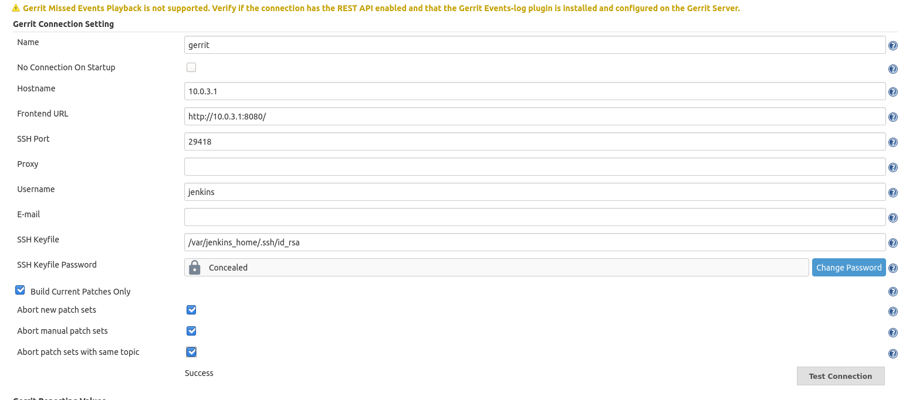

Gerrit and Jenkins setup
************************

We are performing a setup with gerrit and jenkins using docker

Docker install
==============

We use *docker-ce-cli* as package

.. code-block:: sh

    apt-get install docker-ce-cli

create env.sh

.. code-block:: sh

    export IP=10.0.3.1

Run gerrit with persitance

.. code-block:: sh

    . env.sh
    docker run -it --rm -p $IP:8080:8080 -p $IP:29418:29418  \
        -v gerrit-a:/var/gerrit/etc \
        -v gerrit-b:/var/gerrit/git \
        -v gerrit-c:/var/gerrit/db \
        -v gerrit-d:/var/gerrit/index \
        -v gerrit:/var/gerrit/cache \
        -e CANONICAL_WEB_URL=http://$IP:8080/ \
        gerritcodereview/gerrit

Run jenkins with persitance

.. code-block:: sh

    . env.sh
    docker run -it --rm -p $IP:8090:8080 -v jenkins_home:/var/jenkins_home jenkins/jenkins

Configure gerrit

go to http://10.0.3.1:8080/

>> skip intro
>> Admin settings ssh key (upload key)

.. code-block:: sh

    cat .ssh/id_rsa.pub | xclip -selection clipboard

Clone the All-project to add the verified label

.. code-block:: sh

        git clone "ssh://admin@10.0.3.1:29418/All-Projects"
        cd All-Projects
        git fetch origin refs/meta/config:refs/remotes/origin/meta/config
        git config user.name "admin"
        git config user.email "admin@example.com"

Edit project.config to add the Verified block at the end

.. code-block:: sh

    [label "Verified"]
        function = MaxWithBlock
        value = -1 Fails
        value =  0 No score
        value = +1 Verified

Push back the changes

.. code-block:: sh

    git add project.config
    git commit -m "Adding a verified label"
    git push origin HEAD:meta/config

Create a jenkins user

.. code-block:: sh

    ssh -p 29418 admin@$IP gerrit create-account jenkins

Create an ssh key

.. code-block:: sh

        . env.sh
        ID=`docker ps | grep jen | sed "s,.* ,,g"`
        docker exec -it $ID bash
        cd
        ssh-keygen

Upload it to gerrit

.. code-block:: sh

        . env.sh
        ID=`docker ps | grep jen | sed "s,.* ,,g"`
        docker cp $ID:/var/jenkins_home/.ssh/id_rsa.pub .
        cat id_rsa.pub | ssh -p 29418 admin@$IP gerrit set-account --add-ssh-key - jenkins

Allow to connect between jenkins and gerrit

.. code-block:: sh

    ufw allow from 172.17.0.3/24 to 10.0.3.1/24

Add jenkins to the non interactive users

.. code-block:: sh

        . env.sh
        ssh -p 29418 admin@10.0.3.1 gerrit set-members "Non-Interactive\ Users" --add jenkins

Try connecting to gerrit from the jenkins user

.. code-block:: sh

        . env.sh
        ID=`docker ps | grep jen | sed "s,.* ,,g"`
        docker exec -it $ID ssh -p 29418 jenkins@$IP gerrit ls-projects

Following the `Gerrit trigger official documentation <https://plugins.jenkins.io/gerrit-trigger/>`_

.. code-block:: sh

        Admin > Projects > …​ > Access > Edit
            Reference: refs/*
                Read: ALLOW for Non-Interactive Users
            Reference: refs/heads/*
                Label Code-Review: -1, +1 for Non-Interactive Users
                Label Verified: -1, +1 for Non-Interactive Users

Create a gerrit_test project 

.. code-block:: sh

        . env.sh
        ssh -p 29418 admin@10.0.3.1 gerrit create-project gerrit_test

Upload the test repo

.. code-block:: sh

        . env.sh
        cd repo
        git remote rm origin
        git remote add origin ssh://admin@$IP:29418/gerrit_test
        git push origin master

        gitdir=$(git rev-parse --git-dir); scp -p -P 29418 admin@$IP:hooks/commit-msg ${gitdir}/hooks/

Setup jenkins

open to http://10.0.3.1:8080/

.. code-block:: sh

        . env.sh
        ID=`docker ps | grep jen | sed "s,.* ,,g"`
        docker exec -it $ID cat /var/jenkins_home/secrets/initialAdminPassword | xclip -selection clipboard

Login 

Select install suggested plugins
create the admin account

user
    admin
passwd
    admin2k

Install the gerrit-trigger plugin

Configure the plugin by adding a server (select the few options to enable the abort functionality

Create a jew job 
gerrit_test_builder
FreeStyle project

Jenkins plugin setup
********************
